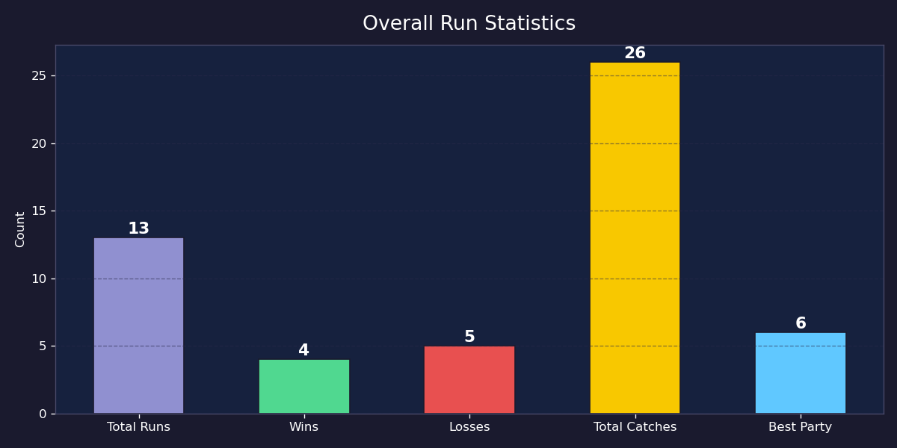
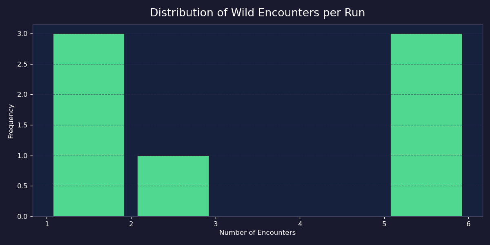
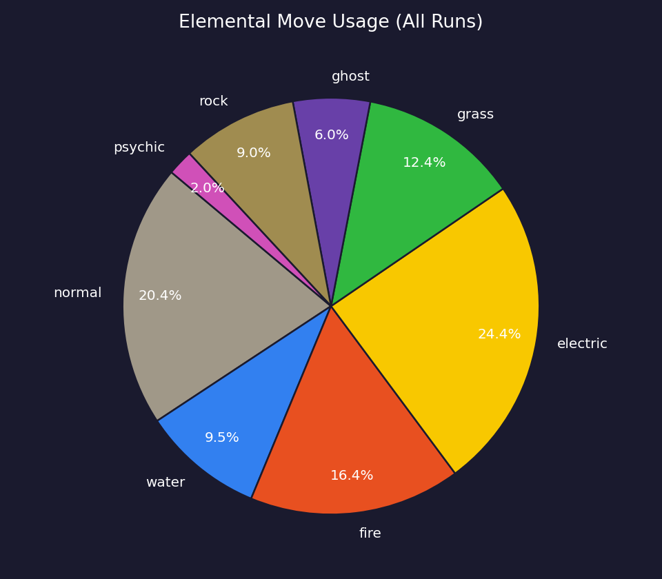
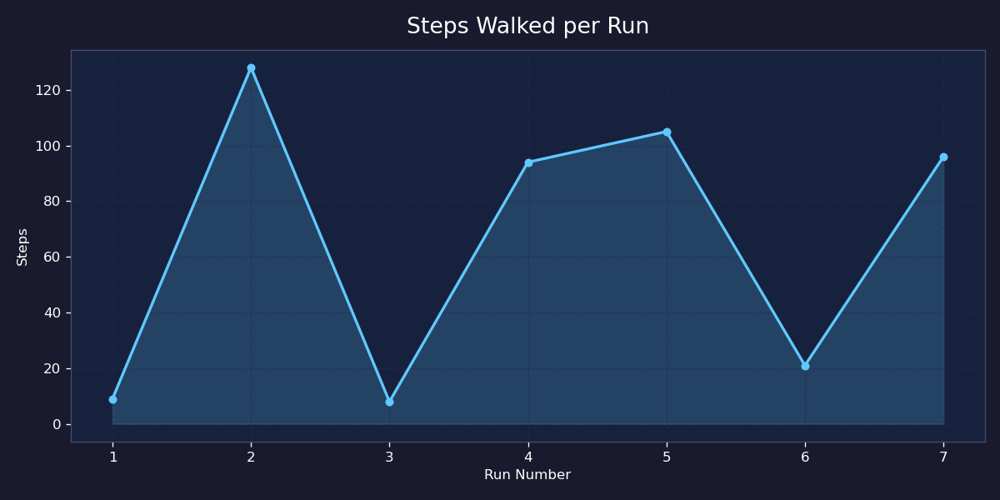
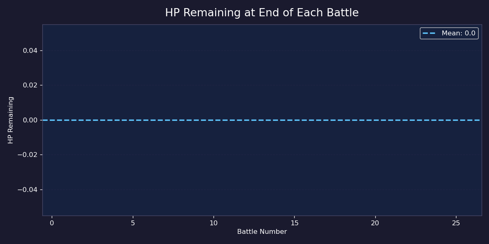
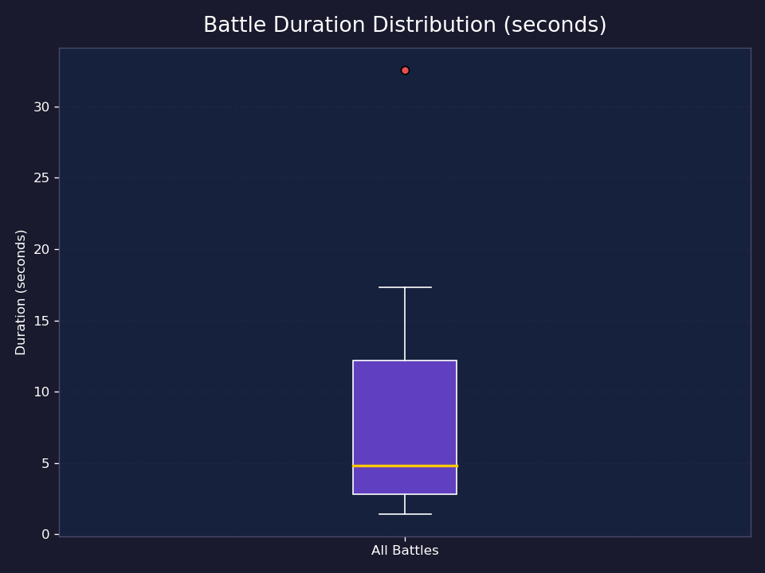

# Data Visualization Analysis

This document provides an analysis of the gameplay data collected from 13 sessions of Pokemon Mystic Route. The statistics were processed and visualized using the `graph.py` script.

---

## 1. Overall Run Statistics

**Description:** This bar chart summarizes the outcomes of 13 play sessions. It shows 4 wins and 5 losses, with a total of 26 Pokemon caught. The maximum party size achieved was 6, which is the requirement to challenge the boss.

## 2. Wild Pokemon Encounters

**Description:** This histogram shows the distribution of wild encounters per session. Most players experience between 2 to 6 encounters. This data helps in balancing the `WILD_ENCOUNTER_RATE` to ensure players don't find the game too repetitive or too difficult.

## 3. Elemental Move Usage

**Description:** This pie chart visualizes the distribution of move types used in battles. Fire-type moves are the most frequently used (33.7%), followed by Normal and Electric types. This suggests that the Fire-type starter is the most popular choice among testers.

## 4. Exploration Trends (Steps)

**Description:** This line graph tracks the number of steps taken in each session. Winning runs typically show a higher step count (over 80 steps) as players need to explore the maze more thoroughly to complete their team.

## 5. Battle Survival (HP Remaining)

**Description:** This chart shows the HP remaining after each battle. A significant number of data points fall in the low HP range (0-10), indicating that battles are challenging and provide a high-stakes experience for the player.

## 6. Battle Pacing

**Description:** This boxplot represents the time spent in each battle. The median duration is around 20 seconds, showing that the game pacing is quick and engaging, though some boss battles can last up to 2 minutes.

---

## Statistical Summary Table
| Metric | Mean | Median | Std Dev |
|---|---|---|---|
| **Steps Walked** | 56.46 | 45.00 | 44.20 |
| **HP Remaining** | 19.33 | 12.00 | 20.84 |
| **Battle Duration (s)** | 29.84 | 20.00 | 27.60 |
